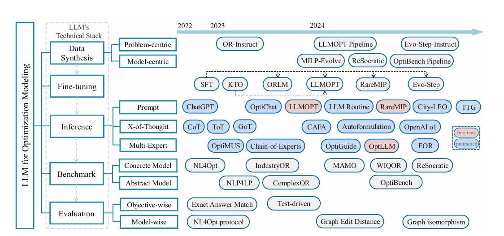
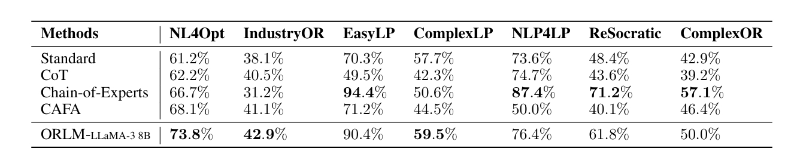

# A Survey of Optimization Modeling Meets LLMs: Progress and Future Directions


## Introduction

<p align="center">

<br><em> Overview of representative works in each step of optimization modeling using LLMs.</em>
<br><em> Left: Taxonomy of LLMs for Operations Research Modeling. Right: We present representative works for each category, sorted by their publication dates</em>
</p>

## LeaderBoard
<p align="center">

<br><em>Performance Comparison of Existing Methods over OR benchmarks.</em>
</p>


## Benchmarks
- Xiao et al: "*Chain-of-Experts: When LLMs Meet Complex Operation Research*", ICLR(2024).
    - <a href="https://openreview.net/forum?id=HobyL1B9CZ"></a> <a href="https://github.com/xzymustbexzy/Chain-of-Experts"></a>
    - abstract modeling
    - contains 37 instances collected from both industrial and academic scenarios
- AhmadiTeshnizi et al: "*OptiMUS: Scalable Optimization Modeling with (MI)LP Solvers and Large Language Models*", arXiv preprint arXiv:2407.19633(2024).
    - <a href="https://arxiv.org/abs/2402.10172"></a> <a href="https://optimus-solver.com/"></a> <a href="https://github.com/teshnizi/OptiMUS"></a>
    - abstract modeling
    - extends the number of instances to 269
- Wang et al: "*OptiBench: Benchmarking Large Language Models in Optimization Modeling with Equivalence-Detection Evaluation*", ICLR(2025). 
    - <a href="https://openreview.net/forum?id=KD9F5Ap878"></a>  <a href="https://github.com/HoshinoAkua/OptiBench"></a>  
    - abstract modeling
    - offers a collection of 816 instances
- Huang et al: "*ORLM: A Customizable Framework in Training Large Models for Automated Optimization Modeling*", arXiv preprint arXiv:2405.17743(2024).
    - <a href="https://arxiv.org/abs/2405.17743"></a> <a href="https://github.com/Cardinal-Operations/ORLM"></a>  
    - covers a variety of problem types, including MIP and NIP
    - features descriptions with or without tabular data
    - suffers from quality con-trol issues, which result in a high error rate.
- Huang et al: "*Mamo: a Mathematical Modeling Benchmark with Solvers*", arXiv preprint arXiv:2405.13144(2024).
    - <a href="https://arxiv.org/abs/2405.13144"></a>
    - includes optimal variable information, offering additional perspectives for evaluating model correctness
    - categorizes problems into three classes:EasyLP,ComplexLP and ODE. 
- Ramamonjison et al: "*NL4Opt Competition: Formulating Optimization Problems Based on Their Natural Language Descriptions*", NeurIPS(2022).
    - <a href="https://proceedings.mlr.press/v220/ramamonjison23a.html"></a> <a href="https://nl4opt.github.io/"></a> <a href="https://github.com/nl4opt/nl4opt-competition"></a>
    - primarily focuses on simple optimization modeling problems.
    - the first optimization modeling benchmark proposed in acompetition 
    - features a test set of 289 instances. 
- Yang et al: "*OptiBench Meets ReSocratic: Measure and Improve LLMs for Optimization Modeling*", ICML(2024).
    - <a href="https://arxiv.org/abs/2407.09887"></a> <a href="https://github.com/yangzhch6/ReSocratic"></a>
    - introduces a com-prehensive framework that applies multiple filters to remove erroneous cases 
    - expands the test set to 605 instances.
- Parashar et al: "*WIQOR: A dataset for what-if analysis of Operations Research problems*", ICLR(2025).
    - <a href="https://openreview.net/forum?id=no8ysO3xde"></a>
    - employs what-if analysis to assess performance

## Data Cleaning
In this work, we identified the error samples in these benchmarks, subsequently tagging them with an "error" label. We provide download links for these labeled benchmarks <a href="[超链接地址](https://github.com/LLM4OR/LLM4OR/tree/master/static/clean_benchmarks)">HERE</a>.


## Papers
### Data Synthesis and Fine-tuning
- Jiang et al: "*LLMOPT: Learning to Define and Solve General Optimization Problems from Scratch*", ICLR(2025).
    - <a href="https://arxiv.org/abs/2410.13213"></a> <a href="https://github.com/caigaojiang/LLMOPT"></a>
- Wu et al: "*Evo-Step: Evolutionary Generation and Stepwise Validation for Optimizing LLMs in OR*", ICLR(2025).
    - <a href="https://openreview.net/forum?id=aapUBU9U0D"></a> <a href="https://github.com/samwu-learn/Evo-Step"></a>
- Li et al: "*Towards Foundation Models for Mixed Integer Linear Programming*", ICLR(2025).
    - <a href="https://arxiv.org/abs/2410.08288"></a> <a href="https://www.microsoft.com/en-us/research/project/optiguide-genai-for-supply-chain-optimization/?msockid=1a1ccce4197d663e1c2bdd4318e1678d"></a> <a href="https://github.com/microsoft/MILP-Evolve"></a>
- Yang et al: "*OptiBench Meets ReSocratic: Measure and Improve LLMs for Optimization Modeling*", ICML(2024).
    - <a href="https://arxiv.org/abs/2407.09887"></a> <a href="https://github.com/yangzhch6/ReSocratic"></a>

### Inference
- Wang et al: "*Leveraging Large Language Models for Solving Rare MIP Challenges*", arXiv preprint arXiv:2409.04464(2024). 
    - <a href="https://arxiv.org/abs/2409.04464"></a>
- Ju et al: "*To the Globe (TTG): Towards Language-Driven Guaranteed Travel Planning*", EMNLP(2024). 
    - <a href="https://arxiv.org/abs/2410.16456"></a>
- Chen et al: "*OptiChat: Bridging Optimization Models and Practitioners with Large Language Models*", arXiv preprint arXiv:2501.08406(2025). 
    - <a href="https://arxiv.org/abs/2501.08406"></a> <a href="https://github.com/li-group/OptiChat"></a>
- Jiao et al: "*City-LEO: Toward Transparent City Management Using LLM with End-to-End Optimization*", arXiv preprint arXiv:2406.10958(2024).
    - <a href="https://arxiv.org/abs/2406.10958"></a>
- Li et al: "*LLM-based Frameworks for Power Engineering from Routine to Novel Tasks*", arXiv preprint arXiv:2305.11202(2023). 
    - <a href="https://arxiv.org/abs/2305.11202v3"></a>
- Wei et al: "*Chain-of-Thought Prompting Elicits Reasoning in Large Language Models*", NeurIPS(2022).
    - <a href="https://arxiv.org/abs/2201.11903"></a>
- Yao et al: "*Tree of Thoughts: Deliberate Problem Solving with Large Language Models*", NeurIPS(2023).
    - <a href="https://arxiv.org/abs/2305.10601"></a> <a href="https://github.com/princeton-nlp/tree-of-thought-llm"></a>
- Besta et al: "*Graph of Thoughts: Solving Elaborate Problems with Large Language Models*", AAAI(2024). 
    - <a href="https://arxiv.org/abs/2308.09687"></a> 
- Chu et al: "*Navigate through Enigmatic Labyrinth A Survey of Chain of Thought Reasoning: Advances, Frontiers and Future*", ACL(2024). 
    - <a href="https://arxiv.org/abs/2309.15402"></a> <a href="https://github.com/zchuz/CoT-Reasoning-Survey"></a>
- Deng et al: "*CAFA: Coding as Auto-Formulation Can Boost Large Language Models in Solving Linear Programming Problem*", NeurIPS(2024). 
    - <a href="https://openreview.net/forum?id=xC2xtBLmri"></a> <a href="https://github.com/BlueAsuka/CAFA"></a>
- Astorga et al: "*Autoformulation of Mathematical Optimization Models Using LLMs*", ICLR(2025).
    - <a href="https://arxiv.org/abs/2411.01679"></a> 
- Qian et al: "*Scaling Large-Language-Model-based Multi-Agent Collaboration*", ICLR(2025).
    - <a href="https://arxiv.org/abs/2406.07155"></a>     <a href="https://github.com/OpenBMB/ChatDev"></a>
- Li et al: "*OptiGuide: Large Language Models for Supply Chain Optimization*", arXiv preprint arXiv:2307.03875(2023).
    - <a href="https://arxiv.org/abs/2307.03875"></a>     <a href="https://github.com/microsoft/OptiGuide"></a>
- Zhang et al: "*Solving General Natural-Language-Description Optimization Problems with Large Language Models*", ACL(2024). 
    - <a href="https://arxiv.org/abs/2407.07924"></a>
- Zhang et al: "*Decision Information Meets Large Language Models: The Future of Explainable Operations Research*", ICLR(2025).
    - <a href="https://openreview.net/forum?id=W2dR6rypBQ"></a> 

### Evaluation
- Xing et al: "*Towards Human-aligned Evaluation for Linear Programming Word Problems*", ACL(2024). 
    - <a href="https://openreview.net/forum?id=AgJXabVaHo"></a>
- Wang et al: "*OptiBench: Benchmarking Large Language Models in Optimization Modeling with Equivalence-Detection Evaluation*", ICLR(2025). 
    - <a href="https://openreview.net/forum?id=KD9F5Ap878"></a>  <a href="https://github.com/HoshinoAkua/OptiBench"></a>  

<!-- ## Citation

If you find this repository helpful, please consider citing our paper:

```bibtex
@article{

}
``` -->

